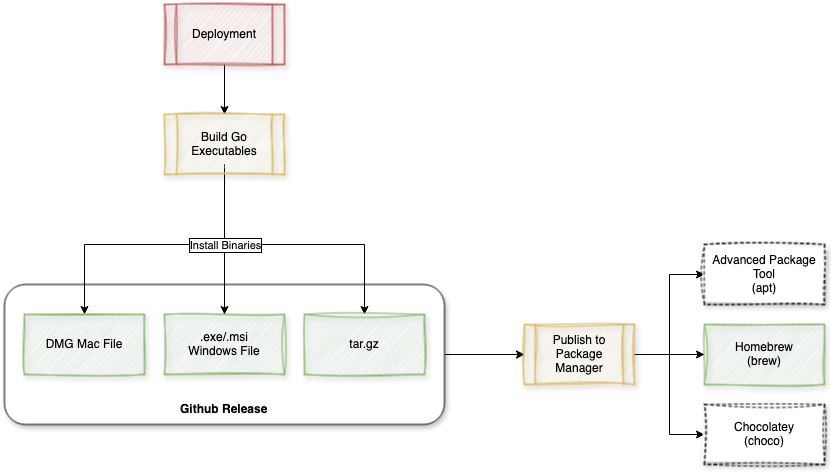

# Bokkoli: A Veggie-to-Veggie Messaging CLI App 🌱

[![LinkedIn][linkedin-shield]][linkedin-url]

Bokkoli is a peer-to-peer **TCP messaging CLI application** built with **Go**, the **Bubbletea** framework, and **SQLite** for message persistence. The name "Bokkoli" is a playful fusion of "broccoli" and "보끔" (boggeum), the Korean word for "mix," reflecting its nature as a blend of technologies.

This lightweight chat application enables **real-time, direct peer-to-peer communication** through a clean, terminal-based interface. Users can easily connect and exchange messages using the TCP protocol, while **SQLite** ensures that conversation history is safely stored locally.

---

## Built With

- 
  **Go** for the backend and message handling.

- 
  **SQLite** for persistent local message storage.

- 
  **Bubbletea** for the UI framework to create a clean terminal interface.
---

## Wireframe

Here’s a look at the design architecture:

**Internal Design:**  


**Deployment Flow:**  


---


### Planned Features 🚀:

- [ ] **Fuzzy Matching**
- [ ] **Questions, Comments, and Suggestion Forum** within the app
- [ ] **Peer Authentication**
- [ ] **Handshake Protocol**
- [ ] **Message Integrity**
  - [ ] Checksums
  - [ ] Digital Signatures
- [ ] **Encryption and Security**
  - [ ] Data Encryption
  - [ ] End-to-End Encryption
- [ ] **Peer Status Monitoring**
  - [ ] Ping/Pong Mechanism
  - [ ] Health Checks
- [ ] **File/Content Sharing**
  - [ ] File Chunking
  - [ ] File Integrity Checks
- [ ] **Unit Testing** for reliability and coverage

---


## Installation Guide 🔧

You can easily install and run the **[Your App Name]** CLI app by downloading the appropriate pre-compiled executable from the [GitHub Releases page](https://github.com/yourusername/yourapp/releases).

Follow the steps below to get started.

### Step 1: Visit the GitHub Releases Page

Go to the official release page of this app:  
[GitHub Releases - Bokkoli](https://github.com/PickledData/bokkoli/releases)

### Step 2: Download the Executable

On the releases page, you will see a list of available versions and their associated executable files. Choose the version you want to install and download the appropriate executable for your operating system:

- **For Windows**:  
  Download `bokkoli_windows.exe`  
  (Click on the file to download.)

- **For macOS**:  
  Download `bokkoli_mac`  
  (Click on the file to download.)

- **For Linux**:  
  Download `bokkoli_linux`  
  (Click on the file to download.)

### Step 3: (For macOS/Linux Users) Set Execute Permissions

If you're using **macOS** or **Linux**, you may need to grant the downloaded file execute permissions before running it.

To do so, open a terminal and navigate to the folder where you downloaded the file. Then run the following command:

```bash
chmod +x bokkoli_mac  # For macOS
chmod +x bokkoli_linux  # For Linux
```
### Step 4: Run the Application

Now you can run the app from the terminal:

    On Windows:
    Simply double-click bokkoli_windows.exe to run the app.
    Alternatively, you can open a command prompt and run:

    ./bokkoli_windows.exe # For Windows
    ./bokkoli_mac  # For macOS
    ./bokkoli_linux  # For Linux


